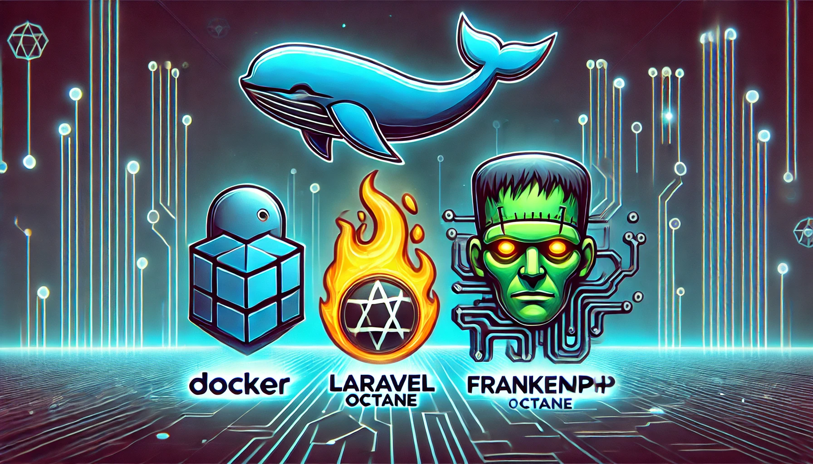

## About Laravel

Template ini hadir untuk memberikan solusi desain modern yang elegan dengan penekanan pada kesederhanaan dan fungsionalitas. Dirancang dengan UI/UX yang intuitif dan responsif, template ini memastikan pengalaman pengguna yang mulus di berbagai perangkat, baik desktop maupun mobile.
Fitur Utama:

- Desain Minimalis: Dengan pendekatan desain yang bersih dan minimalis, template ini mengutamakan elemen-elemen yang penting, memberikan tampilan profesional dan modern.
- Responsif dan Fleksibel: Template ini sepenuhnya responsif, menyesuaikan dengan baik di layar berbagai ukuran tanpa mengorbankan estetika atau kegunaan.
- Pengalaman Pengguna (UX): Fokus pada navigasi yang mudah dan interaktif untuk memastikan pengguna dapat dengan cepat menemukan apa yang mereka cari.
- Kode Terorganisir dengan Baik: Dilengkapi dengan struktur kode yang rapi, dokumentasi yang lengkap, dan siap digunakan untuk berbagai jenis proyek.
- Kompatibel dengan Teknologi Terbaru: Template ini mendukung berbagai framework dan alat pengembangan terbaru untuk memastikan skalabilitas dan kemudahan integrasi.
- Kustomisasi Mudah: Desain yang dapat disesuaikan sesuai dengan kebutuhan spesifik proyek Anda, memungkinkan fleksibilitas tinggi dalam penerapannya.

## Contributing

## Created By

Jeruk Peras
